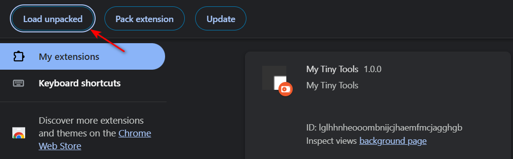

# My Tiny Tools

**_A chrome extension for in-browser timer._**

## Feature

### QR code Generation


1. generate QR code offline

### Timer


1. pause and resume
2. increase or decrease by 1 or 5 minutes
3. tick the time record

## Tech Stack

1. HTML and CSS
2. Bootstrap and jQuery

## User Guide:

**Download and Install the extension in your browser.**

#### Step 1:

For Git users, copy-paste the following line in your **command prompt**.

```
git clone https://github.com/jeremy-kunzhou/my-tiny-tools-Chrome-Extension.git
```

or, click on **Code** button and choose **Download ZIP** at top of this page.

#### Step 2:

- Next, Unzip/Unpack the downloded file.
- Go the your Chrome browser.
- Click on the three dots at top right corner.
- Go to the **More Tools** and then click on **Extensions**.


#### Step 3:

- You will find all your downloded extenions there. Make sure the **Developer Option** is ON. If not, **toggle it to ON**.
- You will see a **Load unpacked** button on left upper corner. Click on that and upload the downloaded unziped file.



**You are all set to use the attractive My Timer Extension.**
